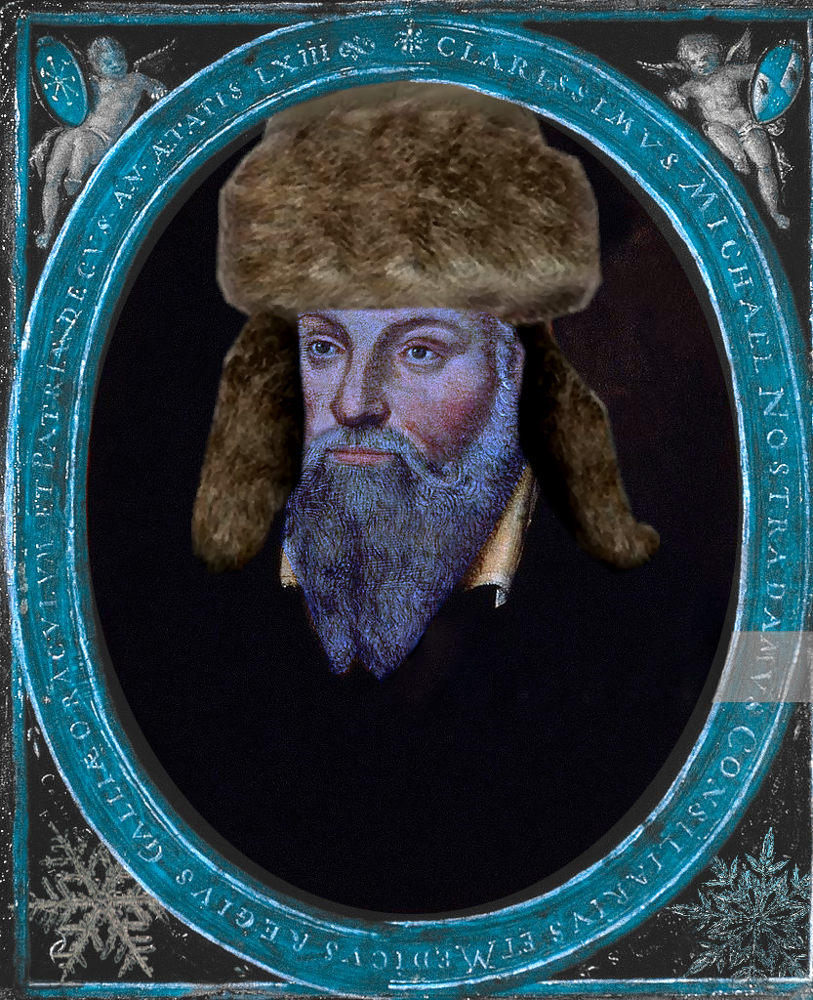

# Snowstradamus

  

Using ICESat-2 Lidar data to model fractional snow cover beneath forest canopies.

## Table of Contents

- [About](#about)
- [Prerequisites](#prerequisites)
- [Notebooks](#notebooks)
- [Scripts](#scripts)
- [Archive](#archive)
- [Acknowledgements](#acknowledgements)

## About

This project holds my work towards my PhD project at the University of Edinburgh, supervised by Steven Hancock. The purpose is to try to use satellite lidar to model fractional snow cover (FSC) beneath forest canopies. This is a known limitation of hydrology models, and an improvement to subcanopy snow modeling would improve the accuracy of such models. This would, for example, potentially give better estimates of water availability to regions that depend on snowpack for fresh water and aid in drought prediction. To the best of my knowledge, the current best model is SCAmod (Metsämäki et al., 2012), which uses satellite imagery (e.g. MODIS data) and transmissivity maps through an algorithm to estimate FSC and compare to FSC from Finnish snow course observations, Finnish weather station observations, and Landsat/ETM+ scenes (which are treated as "ground truth"). This model will be used as a benchmark for comparison.

## Prerequisites

To use these scripts, you need to have ATL03 and corresponding ATL08 data, which are available through NASA Earthdata. In most cases, the spatial subsetting tool in NASA Earthdata was used to preprocess the data to be restricted to a given region of interest. There is potential to investigate whether downloading the entire file and subsetting the data through a Python script could prevent data loss, but I haven`t done that yet.

## Notebooks

`classification_indexing_issue_sodankyla.ipynb`: This demonstrates a problem with classifying photon returns caused by the DAAC subsetting on NASA Earthdata.

`manual_pvpg_computation.ipynb`: This is a template for later work if I want to pursue manual computation of the canopy:ground reflectance ratio for a given land segment. This is opposed to using ATL08 data for 100m land segments.

`parallel_regression_LOCATION.ipynb`: Performs parallel ODR regression on available groundtracks on a given overpass, assuming identical atmospheric conditions, at a location of choice (you need to download the files yourself)

`quality_flagging.ipynb`: This covers an investigation into the variables within the ATL03 and ATL08 data products to consider what may be useful to separate good quality tracks from back quality tracks. It also has some quick notes about variables that may be useful in future classification algorithms.

`relating_ICESat-2_with_0_or_1_FSC.ipynb`: This notebook takes a .csv file with ICESat-2 tracks and their snow cover conditions (validated with snow cam data) and shows statistical diagrams for a cursory analysis.

`shapefile_generation.ipynb`: This generates files you can use to spatially subset regions in NASA Earthdata. I found that if I used the inbuilt tool on NASA Earthdata, I couldn`t spatially subset when downloading data. This should really be a script, I`ll get to that later.

`split_track_into_smaller_sections.ipynb`: Notebook to draft a script that will take ICESat-2 tracks and break them down into fragments that can be treated as separate, short tracks. Used to investigate how much data is needed to robustly separate snow-covered and snow-free data.

`tracks_sodanykla.ipynb`: A brief spatial analysis of the Sodankyla ASC tracks and missingness of the data.

`unet_experiment.upynb`: An investigation into the use of a pre-built CNN (VGG16) to cluster snow cam images, as well as training a model on FSC=0 and FSC=1 snow cam data to attempt to quantify partial snow cover FSC.

## Scripts

`classes_fixed.py`: Script to define ATL03 and ATL08 classes, which are used to read the relevant h5py files. Based on code provided by Matt Purslow, which as been adjusted to allow a choice between removing outliers (original design) or keeping them.

`FSC_dataframe.py`: Takes the `snow_cam_details.csv` file and turns it into a Pandas dataframe with additional information pulled from the ATL08 files.

`imports.py`: Super boring script to import packages that I found myself importing a lot, but I wanted to take up less space.

`odr.py`: Script to perform orthogonal distance regression with a loss function of your choice using `scipy.optimize.least_squares`. Also home to the parallel regression functions used in `parallel_regression.ipynb`.

`parallel.py`: Primary purpose is performing parallel orthogonal distance regression on the groundtracks from a given overpass. In this case, designed to be taken from a single ATL03 file and corresponding ATL08 file.

`pvpg_concise.py`: Essentially the same visualisation as `parallel.py`, except that the regression performed isn't parallel. Each groundtrack is allowed to have its own independent regression.

`shapefile_gen.py`: Useful to make shapefiles to put into the Earthdata spatial subsetting if you want to have exact shapes, e.g. a box with an eight kilometer diameter centred on a point.

`pvpg_phoreal.py`: The same thing as `parallel.py`, but using PhoREAL in case it gets crucial updates that puts my own stuff out of date.

`show_tracks.py`: Contains functions `map_setup` and `show_tracks` to visualize the tracks on a geotiff map that the user must provide. Users can use a colourmap to colour the points by canopy photon return rates or ground photon return rates to easily investigate outliers in the data (spoiler, usually lakes and marshes). This also now contains a function `show_tracks_only_atl03` that shows the tracks that don`t have matching ATL08 files.

`track_pairs.py`: You have downloaded all your ATL03 and ATL08 files and thrown them into a data folder, but whoops, for some reason there`s way more ATL03 files than ATL08 files! That`s weird! Well, good thing you have this script to look through your folder, check which ATL03 files have a corresponding ATL08 file, and save these into an array. It even sorts it by date for you. There is also a parameter to devide if you also want to have a list of all the non-matching files.

## Miscellaneous

`environment.yml`: Useful to make a virtual environment with the relevant packages for this work.

`environment_windows.yml`: Version of the yml file to build a virtual environment for Windows.

`snow_cam_details.csv`: Data containing ICESat-2 tracks and their snow cover conditions on the day of overpass.

## Archive

`regression_ransac_with_ODR_and_arctan_loss.ipynb.`: I tried really hard to make RANSAC work, I really though that the having a regression method that automatically removes outliers would be good. Turns out it`s hard to tune the initial regression to find the outliers that I want to be outliers. Just wasn`t consistent enough.

`rovaniemi_tracks.ipynb`: This is a pretty early exploratory notebook. In a more general sense, you can take a quick look at your tracks and an approximate pv/pg estimation using function `pvpg`. Trust me, just use one of the non-archived notebooks instead to do the same thing but better.

`rovaniemi_tracks_phoreal.ipynb`: Same note about choosing not to pursue using PhoREAL directly.

`rovaniemi_w_parallel_regression.ipynb`: This notebook uses scripts to perform ODR regression on all six (or however many exist in the ROI to a maximum of six) groundtracks simultaneously so that they have the same slope. This assumes that the atmospheric conditions are virtually identical for each track on a given overpass. The region of interest is the forest to the west of Rovaniemi.

`rovaniemi_w_regression_ODR_with_arctan_loss.ipynb`: This notebook shows flaws in orthogonal distance regression with a linear loss function used in literature, demonstrates the use of a function to plot groundtracks over an ROI map (assuming you have a valid geotiff, I used Sentinel-2 data), and shows results from orthogonal distance regression using an arctan loss function to limit the impact of outliers on the regression. The fit of the line is closer to expectations. Additionally, in literature, data points with 0 canopy photons returned were removed entirely to deal with outliers such as lakes, which give extremely high ground photon rates and skew the regression. This method is more capable of dealing with such outliers instead of removing them. The used function allows for choice of loss function. Validation must still be performed on this method. The region of interest is the forest to the west of Rovaniemi

`rovaniemi_w_tracks.ipynb`: This notebook focuses on plotting the tracks in the Rovaniemi_W ROI and monitoring if they are missing ATL08 data or not. This was a brief spatial analysis to look at the data loss I've been seeing.

`strong_weak_beam_comparison.ipynb`: It took me way longer than I`d like to admit to realize that the right and left beams could switch which one was strong and which one was weak. Explains some weird observations I found.

## Acknowledgements

I would like to thank the Centre for Satellite Data in Environmental Science (SENSE) CDT for funding my PhD research and my supervisors Steven Hancock (University of Edinburgh), Richard Essery (University of Edinburgh), Amy Neuenschwander (University of Texas at Austin), and Andrew Ross (University of Leeds) for providing guidance throughout my work. I would also like to thank Matthew Purslow, one of Steven`s former PhD students who worked with ICESat-2 and canopy:ground reflectance ratios and helped me get the ball rolling at the start of my studies.
