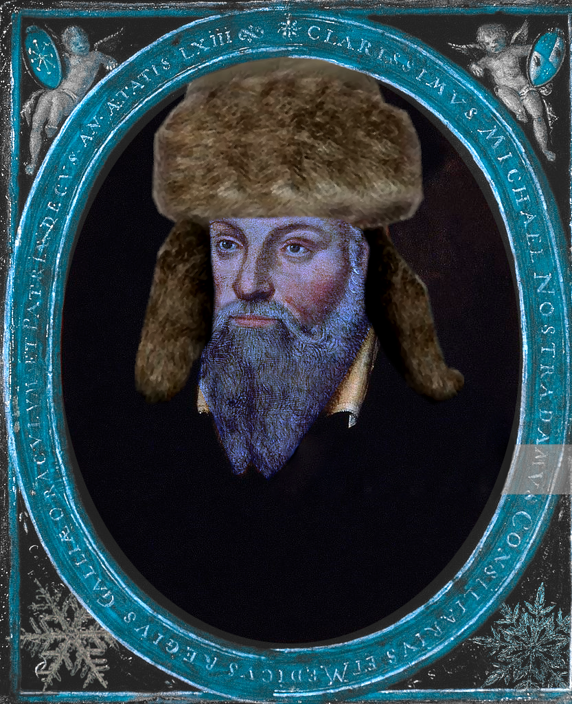

# Snowstradamus

<p align="center">
  
</p>

Snowstradamus is a research project investigating whether ICESat-2 photon-counting LiDAR can be used to detect and estimate fractional snow cover beneath forest canopies.

## Table of Contents

- [About](#about)
- [Method Overview](#method-overview)
- [Data Requirements](#data-requirements)
- [Installation](#installation)
- [Repository Structure](#repository-structure)
- [Notebooks](#notebooks)
- [Scripts](#scripts)
- [Data and Intermediate Results](#data-and-intermediate-results)
- [Dataset Naming Convention](#dataset-naming-convention)
- [Acknowledgements](#acknowledgements)
- [Citation and Licence](#citation-and-licence)

## About

This repository contains work undertaken as part of my PhD at the University of Edinburgh, supervised by Steven Hancock.

The project investigates the use of ICESat-2 ground and canopy radiometry to retrieve snow conditions beneath forest canopies. Conventional optical satellite snow products often have difficulty observing snow beneath vegetation because the canopy obscures the ground. ICESat-2 provides separate information about photons returned from the ground and canopy, potentially allowing sub-canopy snow conditions to be inferred directly.

The project currently includes work on:

- classifying snow-free ground, snow-covered ground, and snow-covered canopy conditions;
- estimating fractional snow cover within forested 1 km cells;
- fitting canopy-cover-line models to ICESat-2 ground and canopy radiometry;
- selecting radiometric and data-quality thresholds using grouped cross-validation and bootstrapping;
- comparing ICESat-2 retrievals with Landsat-based fractional snow-cover algorithms;
- evaluating the influence of slope and aspect;
- comparing results with camera observations and existing snow-cover products; and
- testing how land-cover filtering and atmospheric-quality filtering affect retrieval accuracy.

The intended application is improved monitoring of snow beneath forests. Better estimates of sub-canopy snow cover could support snow and hydrological modelling, particularly in regions where seasonal snowmelt is an important freshwater resource.

## Method Overview

The main processing and analysis workflow is:

1. Download matching ICESat-2 ATL03 and ATL08 granules from NASA Earthdata.
2. Process with PhoREAL.
3. Rebin the ICESat-2 observations into shorter along-track segments, generally 15 m.
4. Apply land-cover, elevation, atmospheric, saturation, and data-quality filters where required.
5. Aggregate the resulting radiometric information within approximately 1 km analysis cells.
6. Classify ground and canopy snow conditions or estimate fractional snow cover.
7. Validate the retrievals using camera observations and Landsat-derived fractional snow cover.
8. Assess performance using grouped cross-validation, bootstrap resampling, confusion matrices, RMSE, and bias.

## Data Requirements

### Required ICESat-2 data

Most processing scripts require matching:

- **ATL03** geolocated photon data; and
- **ATL08** land and vegetation products.

These products are available through [NASA Earthdata](https://earthdata.nasa.gov/).

### Additional datasets

Different parts of the project may also require:

- snow cover observations;
- Landsat surface-reflectance imagery;
- ESA WorldCover land-cover data;
- digital elevation models; and
- Snow CCI or SCAmod snow-cover data.

Raw satellite data are not included in the repository because of their size. Some processed datasets and intermediate results are included. Additional data may be made available by the author upon reasonable request.

## Repository Structure

```text
Snowstradamus/
- bootstrap_images/       Bootstrap figures and diagnostic outputs
- images/                 Output images
- scripts/                Reusable ICESat-2 processing modules
- shapefiles/             Regions of interest and spatial input files
- *.ipynb                 Processing and analysis notebooks
- bootstrap_results*.py   Bootstrap and validation scripts
- generate_dataframe.py   Main dataframe-generation workflow
- generate_shapefile.py   Region-of-interest shapefile generator
- *.pkl                   Processed and intermediate data
- *.xlsx                  Camera and snow-condition records
- environment*.yml        Conda environment definitions
- README.md
```

## Notebooks

### ICESat-2 snow classification and validation

`FSC_dataframe_analysis_binary.ipynb`  
Analysis of the ICESat-2-based classification of snow-free ground, snow-covered ground, and canopy snow conditions.

`FSC_dataframe_analysis_80m_OG.ipynb`  
Earlier version of the fractional snow-cover analysis using an 80 m elevation tolerance.

`FSC_dataframe_analysis_80m_bootstrapped.ipynb`  
Bootstrap-based version of the 80 m analysis. This notebook was used as a development environment for the standalone bootstrap scripts.

### Parallel radiometric regression

`parallel_regression.ipynb`  
Fits and visualises parallel orthogonal-distance regressions for an ICESat-2 overpass. These regressions are used to estimate ground and canopy radiometry while sharing a common slope between beams.

`parallel_regression_testing.ipynb`  
Development notebook for testing changes to the parallel-regression method and inspecting individual overpasses.

### Landsat fractional snow cover

`landsat_FSC_algorithms.ipynb`  
Applies and evaluates Landsat-based fractional snow-cover algorithms used for comparison with the ICESat-2 results.

`landsat_FSC_algorithms_false-color.ipynb`  
Variant of the Landsat workflow that includes false-colour Landsat composites and visual comparisons with the derived snow-cover maps.

`landsat_algorithms_check.ipynb`  
Diagnostic checks of the Landsat snow-cover algorithms and their input masks.

### Terrain, aspect, and gradient analysis

`aspect_results.ipynb`  
Examines how terrain and aspect influence fractional snow-cover retrieval performance.

### Snow products and temporal analysis

`snow_cci_SCFG.ipynb`  
Analysis of Snow CCI or SCAmod fractional snow-cover estimates. This includes elevation-tolerance testing, snowmelt timelines, and binary snow-cover accuracy.

### Spatial preparation and visualisation

`shapefile_generation.ipynb`  
Notebook version of `generate_shapefile.py`, used to construct regions of interest for spatial subsetting.

`visualise_tracks.ipynb`  
Visualises ICESat-2 ground tracks over a selected region of interest.

## Scripts

### Core modules in `scripts/`

`classes_fixed.py`  
Defines classes used to read ATL03 and ATL08 HDF5 files. This code was originally based on code provided by Matt Purslow and was modified to allow processing with or without outlier removal.

`FSC_dataframe.py`  
Builds a Pandas dataframe from the site and snow-condition records in `snow_cam_details.xlsx`, adding information extracted from the corresponding ATL08 files.

`imports.py`  
Provides commonly used package imports for the notebooks and scripts.

`odr.py`  
Implements orthogonal-distance regression using `scipy.optimize.least_squares`. It also contains functions used by the parallel-regression workflow.

`parallel.py`  
Performs parallel orthogonal-distance regression on the beams from an ICESat-2 overpass. The beam regressions share a common slope while retaining separate intercepts.

`pvpg_concise.py`  
Provides a similar visualisation to `parallel.py`, but fits each ground track independently rather than constraining the regressions to be parallel.

`pvpg_phoreal.py`  
Alternative implementation of the radiometric analysis using PhoREAL.

`show_tracks.py`  
Contains functions for plotting ICESat-2 tracks over a supplied GeoTIFF. Points can be coloured by ground or canopy photon-return rate to help identify spatial outliers such as lakes and marshes.

It also includes `show_tracks_only_atl03`, which identifies ATL03 tracks without corresponding ATL08 files.

`track_pairs.py`  
Searches a directory for matching ATL03 and ATL08 granules, pairs them, and sorts the matched files by date. It can also return ATL03 files for which no matching ATL08 file is available.

### Top-level processing scripts

`generate_dataframe.py`  
Generates the main processed ICESat-2 dataframe. Its configuration controls options such as rebinning distance, land-cover selection, elevation tolerance, atmospheric filtering, outlier removal, spatial aggregation, and regression settings.

`generate_dataframe.slurm`  
SLURM submission script for running `generate_dataframe.py` on a computing cluster.

`generate_shapefile.py`  
Creates a spatial file, normally GeoJSON, defining a box with a specified centre, width, height, and name. This can be used when requesting spatial subsets of ATL03 and ATL08 data.

### Bootstrap and model-evaluation scripts

`bootstrap_results.py`  
Earlier version of the bootstrap analysis.

`bootstrap_results_2.py`  
Runs the main bootstrap analysis for the ICESat-2 classification or fractional snow-cover model. Important settings include the input dataframe, number of bootstrap iterations, number of cross-validation folds, radiometric threshold grid, and data-quality threshold grid.

## Data and Intermediate Results

### Observation tables

`snow_cam_details.xlsx`  
Site, overpass, and camera-derived snow-condition information used to label ICESat-2 observations.

`SCFG_binary.xlsx`  
Binary ground observations used to evaluate Snow CCI or SCAmod snow-cover estimates.

`snow_timeline.xlsx`  
Snow-condition timeline used in the temporal snow-cover analysis.

### Processed ICESat-2 data

`dataset_lcforest_noLOF_bin15_th3_80m_1kmsmallbox_noprior_ta_wc1_v7.pkl`  
Processed ICESat-2 dataset using forest-only land cover, 15 m rebinning, no Local Outlier Factor removal, an 80 m elevation tolerance, 1 km cells, atmospheric filtering, ESA WorldCover masking, and version 7 ATL03/ATL08 products.

### Other intermediate files

`bootstrap_images/`  
Figures and diagnostics produced by the bootstrap analysis.

`images/`  
Images used in the README and analysis outputs.

`shapefiles/`  
Spatial regions of interest and supporting vector files.

Files such as `generate_dataframe.out` and `generate_dataframe.err` are cluster execution logs and are not required to run the analysis.

## Dataset Naming Convention

Processed dataset filenames encode the settings used to generate them.

| Token | Meaning |
|---|---|
| `lcforest` | Only forest land-cover classes were retained |
| `lcall` | A broader set of land-cover classes was retained, excluding unsuitable classes such as water or urban areas |
| `LOF` | Local Outlier Factor filtering was applied |
| `noLOF` | Local Outlier Factor filtering was not applied |
| `bin15` | ATL08 observations were rebinned to 15 m segments |
| `th3` | A beam required at least three segments within the analysis cell |
| `80m` | An elevation tolerance of �80 m was applied |
| `1kmsmallbox` | The regional data were divided into approximately 1 km analysis cells |
| `noprior` | No bimodal prior was imposed on the regression slope |
| `ta` | Atmospheric filtering was applied before fitting the parallel regression |
| `wc1` | ESA WorldCover was used for land-cover masking |
| `dw1` | Dynamic World was used for land-cover masking in older datasets |
| `v7` | Version 7 ATL03 and ATL08 products were used |

When a dataset is not marked `noprior`, the regression may include a penalty encouraging the canopy-to-ground reflectance ratio towards one of two expected ranges: approximately 0.1-0.2 or 0.8-1.0.

## Reproducibility Notes

Several notebooks and scripts are retained as development or historical versions. For a reproducible release, the repository should eventually identify:

- the canonical dataframe-generation command and configuration;
- the canonical bootstrap script;
- the final input dataset;
- the notebooks used to generate each manuscript figure and table;
- the random seeds used for bootstrapping and cross-validation;
- the required external datasets and their versions; and
- the expected output files from each stage.

## Acknowledgements

I would like to thank the Centre for Satellite Data in Environmental Science (SENSE) CDT for funding this PhD research.

I am grateful to my supervisors and collaborators:

- Steven Hancock, University of Edinburgh;
- Richard Essery, University of Edinburgh;
- Amy Neuenschwander, University of Texas at Austin; and
- Andrew Ross, University of Leeds.

I also thank Matt Purslow for his work that formed the basis of parts of our research.