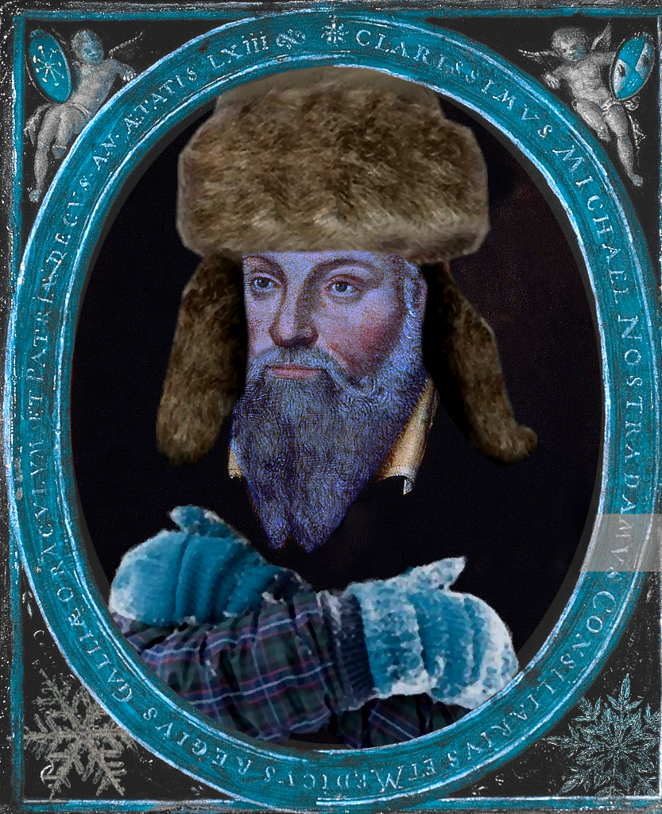

# Snowstradamus

  

Using ICESat-2 Lidar data to model fractional snow cover beneath forest canopies.

## Table of Contents

- [About](#about)
- [Prerequisites](#prerequisites)
- [Notebooks](#notebooks)
- [Scripts](#scripts)
- [Miscellaneous](#miscellaneous)
- [Acknowledgements](#acknowledgements)

## About

This project holds my work towards my PhD project at the University of Edinburgh, supervised by Steven Hancock. The purpose is to try to use satellite lidar to model fractional snow cover (FSC) beneath forest canopies. This is a known limitation of hydrology models, and an improvement to subcanopy snow modeling would improve the accuracy of such models. This would, for example, potentially give better estimates of water availability to regions that depend on snowpack for fresh water and aid in drought prediction. To the best of my knowledge, the current best model is SCAmod (Metsämäki et al., 2012), which uses satellite imagery (e.g. MODIS data) and transmissivity maps through an algorithm to estimate FSC and compare to FSC from Finnish snow course observations, Finnish weather station observations, and Landsat/ETM+ scenes (which are treated as "ground truth"). This model will be used as a benchmark for comparison.

## Prerequisites

To use most these scripts, you need to have ATL03 and corresponding ATL08 data, which are available through NASA Earthdata. Some scripts require other data, which is described where necessary.

## Notebooks

`FSC_dataframe_analysis.ipynb`: Accuracy analysis of ATL08-based binary classification of ground snow/non-snow and canopy snow/non-snow.

`als_testing.ipynb`: Notebook to analyze how ALS derived canopy cover affects ICESat-2, MOD10A1F, and SCAmod estimates. Requires canopy cover geotiffs.

`image_processing.ipynb`: Notebook investigating automatically measuring FSC from an image. Requires camera imagery with snow in a forest.

`machine_learning.ipynb`: Notebook investigating using machine learning to estimate snow cover from ATL08 data.

`parallel_regression.ipynb`: Playground to see how parallel regression looks for a given overpass.

`pvpg_penalty.ipynb`: Playground for implementing a bimodal penalty to the slope in the parallel regression.

`shapefile_generation.ipynb`: Notebook version of `generate_shapefily.py`.

`topographical_variation.ipynb`: Notebook investigating whether I can use the topography of an area to predict snow cover around a given area. Spoilers, not well.

`torgnon_elevation_check.ipynb`: Notebook investigating how similar snow conditions are as a function of local elevation, i.e. if we are in a mountainous area and estimate FSC, how many meters can we climb or drop before our estimate is no longer adequate?

`tracks_sodankyla_ipynb`: To visualize the tracks crossing your area of interest. Requires a tiff of your area of interest, I used Sentinel-2.

`unet_experiment.ipynb`: A cursory look at using machine learning to automatically estimate snow cover in images. Not as good as I would like, but the plotting is actually quite interesting.

## Scripts

`classes_fixed.py`: Script to define ATL03 and ATL08 classes, which are used to read the relevant h5py files. Based on code provided by Matt Purslow, which as been adjusted to allow a choice between removing outliers (original design) or keeping them.

`FSC_dataframe.py`: Takes the `snow_cam_details.csv` file and turns it into a Pandas dataframe with additional information pulled from the ATL08 files.

`imports.py`: Super boring script to import packages that I found myself importing a lot, but I wanted to take up less space.

`odr.py`: Script to perform orthogonal distance regression with a loss function of your choice using `scipy.optimize.least_squares`. Also home to the parallel regression functions used in `parallel_regression.ipynb`.

`parallel.py`: Primary purpose is performing parallel orthogonal distance regression on the groundtracks from a given overpass. In this case, designed to be taken from a single ATL03 file and corresponding ATL08 file.

`pvpg_concise.py`: Essentially the same visualisation as `parallel.py`, except that the regression performed isn't parallel. Each groundtrack is allowed to have its own independent regression.

`shapefile_gen.py`: Useful to make shapefiles to put into the Earthdata spatial subsetting if you want to have exact shapes, e.g. a box with an eight kilometer diameter centred on a point.

`pvpg_phoreal.py`: The same thing as `parallel.py`, but using PhoREAL in case it gets crucial updates that puts my own stuff out of date.

`show_tracks.py`: Contains functions `map_setup` and `show_tracks` to visualize the tracks on a geotiff map that the user must provide. Users can use a colourmap to colour the points by canopy photon return rates or ground photon return rates to easily investigate outliers in the data (spoiler, usually lakes and marshes). This also now contains a function `show_tracks_only_atl03` that shows the tracks that don`t have matching ATL08 files.

`track_pairs.py`: You have downloaded all your ATL03 and ATL08 files and thrown them into a data folder, but whoops, for some reason there`s way more ATL03 files than ATL08 files! That`s weird! Well, good thing you have this script to look through your folder, check which ATL03 files have a corresponding ATL08 file, and save these into an array. It even sorts it by date for you. There is also a parameter to devide if you also want to have a list of all the non-matching files.

## Miscellaneous

`environment.yml`: Useful to make a virtual environment with the relevant packages for this work.

`environment_windows.yml`: Version of the yml file to build a virtual environment for Windows.

`snow_cam_details.xlsx`: Data containing ICESat-2 tracks and their snow cover conditions on the day of overpass.

`SCFG_binary.xlsx`: Binary ground observations of snow conditions from 2019 and 2020.

`adjust_df_cc.py`: Script to add ALS canopy cover to the SCFG dataframe generated from `SCFG_binary.xlsx`.

`dataset_landcover_....pkl`: Rebinned ATL08 data according to different parameters. `forest` uses just forested landcover classes, `all` uses some extra ones, but no water, urban, or permanent snow/ice. The number after that is the percentage assumed outlier for Mahalanobis thresholding. `th_` is how many segments a beam must have within the box to be considered in the parallel regression. `1km` means that we are splitting the data into 1km sub-boxes, otherwise we are looking at the entire 8x8km region. If not `noprior`, then the slope of the regression has a penalty that pushes the slope to a bimodal prior, assuming that the canopy:ground reflectance ratio is either around 0.1-0.2 or around 0.8-1.0. `ta` means that an atmospheric scattering filter was applied BEFORE parallel regression. `SCFG` and `cc` mean that the relevant dataframe was modified to include SCFG estimates or canopy cover for each entry.

`generate_dataframe.py`: Generate dataframe from ATL08 data to be used for analysis according to input parameters.

`generate_shapefile.py`: Given coordinates, width, height, and a name, generates a file (default geojson) for a box centred at the coordinates. Useful for downloading regional data for ATL03 and ATL08.

`percentage_threshold_variation.py`: Script to generate graphs for how local elevation change affects `MOD10A1F` snow cover. Requires a DEM and `MOD10A1F` data.

`scfg.py`: Takes the ATL08 dataframe that you generate with generate_dataframe.py and attaches the corresponding SCFG FSC estimate to it if it exists.

`work_in_progress.pkl`: Bad naming, it's made in the `als_testing.ipynb` notebook. It adds canaopy cover to the dataframe generated by generate_dataframe.py.

## Acknowledgements

I would like to thank the Centre for Satellite Data in Environmental Science (SENSE) CDT for funding my PhD research and my supervisors Steven Hancock (University of Edinburgh), Richard Essery (University of Edinburgh), Amy Neuenschwander (University of Texas at Austin), and Andrew Ross (University of Leeds) for providing guidance throughout my work. I would also like to thank Matthew Purslow, one of Steven`s former PhD students who worked with ICESat-2 and canopy:ground reflectance ratios and helped me get the ball rolling at the start of my studies.
